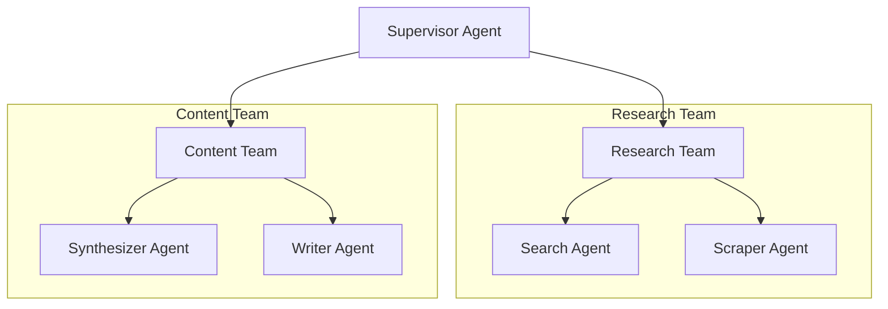

# MultiAgent Researcher 🤖📚

A powerful multi-agent system for automated research using LangGraph and LangChain. This system coordinates multiple AI agents to perform comprehensive research on any given topic.

## 🌟 Features

- **Automated Research Pipeline**: From topic to final content
- **Multi-Agent Architecture**:
  - Supervisor Agent: Coordinates the research process
  - Research Team: Search and scraping agents
  - Content Team: Synthesis and writing agents
- **Smart Content Processing**: Analyzes and combines information from multiple sources
- **Configurable Workflow**: Easy to modify and extend

## 🛠️ Architecture


## 🚀 Getting Started

### Prerequisites

- Python 3.9+
- Poetry (Python package manager)
- OpenAI API key
- Tavily API key (for search capabilities)

### Installation

1. Clone the repository:
    ```bash
    git clone https://github.com/A-PachecoT/multiagent-researcher.git
    cd multiagent-researcher
    ```

2. Set up environment:
    ```bash
    cp .env.example .env
    ```
    Edit .env with your API keys:
    ```bash
    nano .env
    ```

3. Install dependencies:
    ```bash
    make setup
    ```

### Usage

Run the example research:
```bash
make example
```

Or run a specific research topic:
```bash
make run
```

## 🧪 Testing

Run the test suite:
```bash
make test
```

Format code:
```bash
make format
```

Run linting:
```bash
make lint
```

## 📁 Project Structure
```
multiagent-researcher/
├── src/
│ ├── agents/
│ │ ├── supervisor.py # Supervisor agent implementation
│ │ ├── research_team.py # Research team agents
│ │ └── content_team.py # Content team agents
│ ├── tests/
│ │ └── test_research.py # Test suite
│ ├── examples/
│ │ └── research_example.py # Usage examples
│ ├── main.py # Main entry point
│ └── state.py # State management
├── Makefile # Development commands
├── pyproject.toml # Project configuration
└── README.md # This file
```

## 🔄 Workflow

1. User provides a research topic
2. Supervisor agent creates a research plan
3. Research team:
   - Search agent finds relevant sources
   - Scraper agent extracts key information
4. Content team:
   - Synthesizer agent analyzes information
   - Writer agent creates final content
5. Final research is delivered

## 🛡️ License

This project is licensed under the MIT License - see the [LICENSE](LICENSE) file for details.

## 🤝 Contributing

Contributions are welcome! Please feel free to submit a Pull Request.

1. Fork the repository
2. Create your feature branch (`git checkout -b feature/AmazingFeature`)
3. Commit your changes (`git commit -m 'feat: add some AmazingFeature'`)
4. Push to the branch (`git push origin feature/AmazingFeature`)
5. Open a Pull Request

## 📝 Todo

- [ ] Add support for more search engines
- [ ] Implement citation management
- [ ] Add support for academic paper formats
- [ ] Improve error handling and recovery
- [ ] Add support for concurrent research tasks

## 📧 Contact

Andre Pacheco - andre.pacheco.t@uni.pe

Project Link: [https://github.com/A-PachecoT/multiagent-researcher](https://github.com/A-PachecoT/multiagent-researcher)
